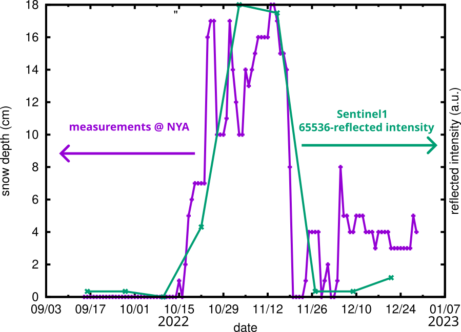

# Modelling a RADAR corner reflector coated with various dielectric layer geometries

Various authors have been considering the use of RADAR corner reflectors for assessing
snow cover layer thickness and properties (see https://www.mdpi.com/2072-4292/11/8/988 
by E. Trouve & al). 

Our own measurements in Spitsbergen hint at a dramatic reflectivity loss as soon as even
a slight snow layer covers some of the faces of the corner reflector, and even in case
of apparently dense homogeneous dry snow filling the corner reflector.

The GNU Octave raytracing software aims at assessing the impact of a various dielectric
layers coating one side of a trihedral square corner reflector of unit size. While a 
homogeneous layer parallel to one side has hardly any impact, the realistic case of even
a slight angle between the deposited layer and the reflecting mirror surface induces
dramatic loss by directing the rays away from the monostatic RADAR.

In the above figure, ``nd`` represents the normal vector of the layer defining the dielectric
layer interface, with [1 0 0] representing a layer parallel to the face in the yOz plane
and [1 1 1] a layer filling the corner reflector.

When running the simulation with ``display=1`` the rays will be traced (easier to see on a single
ray by uncommenting TEST lines for a single theta angle and a single s, t pair for a single ray): blue
are rays hitting the corner mirrors, green is a ray hitting the dielectric layer, red is the outgoing
ray towards the receiver. The signal is considered detected if the outgoing and incoming ray are
parallel.

The right picture emphasizes how the incoming ray (green, left) is refracted at the air-snow
interface, reflected 3 times on the corner reflector mirrors, and then refracted again (red, right)
before returning to the receiver. If the dielectric layer is not parallel to the mirror faces, the
returned signal is not parallel to the incoming signal and is not backscattered towards the receiver.

## Experimental setup

A 1-m trihedral corner reflector was installed on solid rock close to Ny Alesund at Corbel
station ([12.11778E, 78.90365N](https://goo.gl/maps/qpgrMF41vFTqENkcA)) since September
2021 oriented Eastward so that it is illuminated by descending passes of Sentinel1. The
data are either retrived as IW/SLC information from ESA Copernicus data hub or as processed 
GeoTIF files from [ESA EO Browser](https://apps.sentinel-hub.com/eo-browser/?zoom=13&lat=78.903&lng=12.1053).

## Experimental results

The following chart displays the snow depth measurement in Ny-Alesund station and
the inverse (maximum - measurement) of the corner reflector intensity as recorded
by the spaceborne Sentinel1 RADAR operating in the C-band (5.405 GHz).

## Running the program

The ``reflection.m`` is a simple GNU Octave raytracing program assuming a square trihedral corner
reflector with sides in the X, Y and Z planes and unit dimensions. Under GNU Octave, running ``reflection``
shoud sweep the emitter location and record the reflected signal as a function of incident angle in a monostatic
configuration. At the end, plotting ``plot([-195:1:-55],final)`` displays the reflected signal as a 
function of incident angle at a given elevation ``phi`` set to 30 degrees, close to the ideal 36 degree value.
The ideal condition of a bare corner reflector is selected with ``snowcase=0``. Various other dielectric
layers are selected with ``snowcase>0`` in the program header, with 1 for a corner reflector filled with snow,
2 for the bottom surface coated with snow parallel to the mirror, 3 for a side coated with snow parallel to the mirror,
4 for one side coated with a layer of snow tilted in both angles and 5 for a side coated with a layer of
snow tilted in a single angle. ``mu`` is the ratio of the optical index (square root of the permittivity) to
vacuum, selected to 1.3 arbitrarily.

